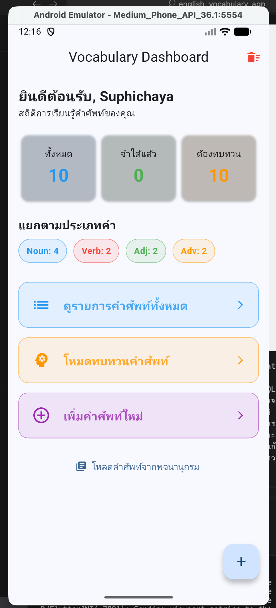

ชื่อ: Personal English Vocabulary App

คำอธิบาย: แอปพลิเคชันสำหรับบันทึกและจัดการคำศัพท์ภาษาอังกฤษส่วนตัว พัฒนาด้วย Flutter โดยเน้นการใช้งานที่ง่ายและช่วยให้ผู้ใช้จดจำคำศัพท์ได้อย่างมีประสิทธิภาพ

ฟีเจอร์หลัก
 - CRUD Operations: เพิ่ม (Create), เรียกดู (Read), แก้ไข (Update) และลบ (Delete) คำศัพท์ได้สมบูรณ์

 - Dashboard System: หน้าสรุปสถิติคำศัพท์ทั้งหมด, คำศัพท์ที่จำได้แล้ว และคำศัพท์ที่ต้องทบทวน

 - Search System: ค้นหาคำศัพท์ได้แบบ Real-time ทั้งจากคำศัพท์, คำแปล หรือประเภทของคำ

 - Review Mode (Flashcards): ระบบสุ่มคำศัพท์ที่ยังจำไม่ได้มาทดสอบ พร้อมเฉลยและตัวอย่างประโยค

 - Local Database: จัดเก็บข้อมูลถาวรในเครื่องด้วย SQLite

 - Validation: ระบบตรวจสอบการกรอกข้อมูล ป้องกันการบันทึกค่าว่าง

 โครงสร้างสถาปัตยกรรม
  - State Management: ใช้ Provider ร่วมกับ ChangeNotifier เพื่อจัดการข้อมูลและอัปเดต UI อัตโนมัติ (Reactive UI)

  - Pattern: แบ่งแยกส่วน Logic (Provider), Data (Model/Database) และ UI (Screens) ออกจากกันชัดเจน

  lib/
├── main.dart                 # จุดเริ่มต้นของแอป (กำหนด Theme และ Provider)
├── models/
│   └── word_model.dart       # คลาสข้อมูลคำศัพท์ (Word Object & Map Conversion)
├── providers/
│   └── word_provider.dart    # ส่วนจัดการ State และ Logic (หัวใจของแอป)
├── services/
│   └── database_helper.dart  # ส่วนเชื่อมต่อ SQLite (CRUD Operations)
└── screens/                  # ส่วนแสดงผลหน้าจอทั้งหมด (UI)
    ├── dashboard_screen.dart # หน้าแรกสรุปสถิติ (Dashboard)
    ├── word_list_screen.dart # หน้าแสดงรายการคำศัพท์และช่องค้นหา
    ├── word_detail_screen.dart# หน้าแสดงรายละเอียดคำศัพท์ (และปุ่มลบ/แก้ไข)
    ├── word_form_screen.dart   # หน้าเพิ่มและแก้ไขคำศัพท์ (Validation)
    └── word_review_screen.dart # หน้าโหมดทบทวนคำศัพท์ (Flashcards)

หน้า Dashboard (หน้าแรก):
สิ่งที่ต้องโชว์: ตัวเลขสถิติ (ทั้งหมด, จำได้แล้ว, ต้องทบทวน) และกราฟประเภทคำ (Tags)
คำอธิบาย: แสดงภาพรวมของการเรียนรู้และสถิติคำศัพท์ในคลังข้อมูล

หน้ารายการคำศัพท์ (Word List):
สิ่งที่ต้องโชว์: รายการคำศัพท์ที่เรียงกันสวยงาม และ การลองพิมพ์ค้นหา (Search) ในช่องด้านบน
คำอธิบาย: แสดงระบบการจัดการข้อมูลและการค้นหาแบบ Real-time (Filter)

หน้าโหมดทบทวน (Review Mode / Flashcard):
สิ่งที่ต้องโชว์: การ์ดคำศัพท์ที่ซ่อนเฉลย (มีเครื่องหมาย ???) และภาพตอนที่กดเฉลยแล้วเห็นคำแปลกับตัวอย่างประโยค
คำอธิบาย: แสดงฟีเจอร์ช่วยจำคำศัพท์ผ่านระบบสุ่ม Flashcards

หน้าเพิ่ม/แก้ไขคำศัพท์ (Form & Validation):
สิ่งที่ต้องโชว์: ช่องกรอกข้อมูล และ ภาพตอนที่ลืมกรอกแล้วมีตัวหนังสือสีแดงเตือน (Validation Error)
คำอธิบาย: แสดงระบบตรวจสอบความถูกต้องของข้อมูลก่อนบันทึกลง SQLite

หน้าแสดงรายละเอียด (Word Detail):
ยละเอียดคำศัพท์แบบเต็มๆ และปุ่มแก้ไข/ลบ
คำอธิบาย: แสดงข้อมูลเชิงลึกของแต่ละคำศัพท์

